# <center>Bendak's Sandwich Shop

---

This program allows the user to build an order from the sandwich shop and checkout. 
When an order is confirmed, a receipt is generated and written to a text file.

---

## Project Overview

- Console-based sandwich ordering system.
- Fully build customized sandwiches down to the toppings, sides, and sauces.
- Add drinks and chips to a shared cart.
- View cart, see the total, and confirm or cancel orders.
- On checkout, a receipt is generated and saved to a text file. 

---

## UML Diagram

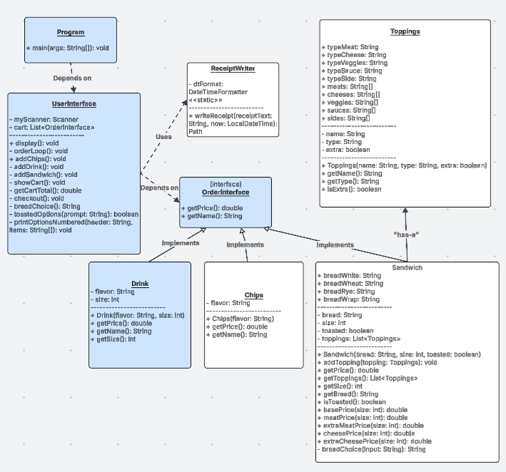
---

## My Classes and Their Uses

### Interfaces

|  Interface                | Purpose                                                                                                          |
|---------------------------|------------------------------------------------------------------------------------------------------------------|
| <center> `OrderInterface` | <center> Ensures all orderable items provide `getName()` and `getPrice()`, so they can be handled in one cart. |

---

### Models

|  Class                                       | Purpose                                                                                                                                                      |
|----------------------------------------------|--------------------------------------------------------------------------------------------------------------------------------------------------------------|
| <center> `Sandwich`                          | <center> Represents a customizable sandwich (bread, size, toasted) and holds a `List<Toppings>`. Calculates total sandwich price based on size and toppings. |
| <center> `Drink`                             | <center> Represents a drink with `flavor` and `size`. Price is determined by drink size.                                                                     |
| <center> `Chips`                             | <center> Represents a bag of chips with a chosen `flavor` and a set price.                                                                                   |


---

### UI & Utility

| Class             | Purpose                                                                                                                                |
|-------------------|----------------------------------------------------------------------------------------------------------------------------------------|
| <center> `UserInterface` | <center> Handles all console screens and user input. Manages a `List<OrderInterface>` cart, builds items, shows cart, and runs checkout. |
| <center> `Program`       | <center> Entry point (`main` method). Starts the app by utilizing `UserInterface` to call `display()`.                          |
| <center> `ReceiptWriter` | <center> Writes the final receipt text to a `.txt` file in `src/main/resources/receipts`.                                   |

---

## <center>Screens

### Home Screen:
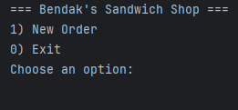
### Order Screen:
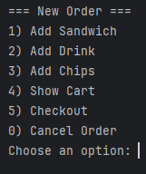
### Choose Bread:
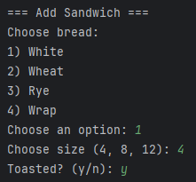
### Choose Meat:
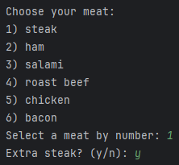
### Choose Cheese:
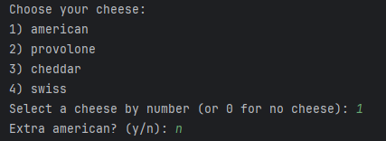
### Choose Veggies:
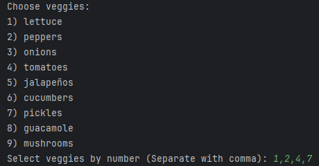
### Choose Sauces:
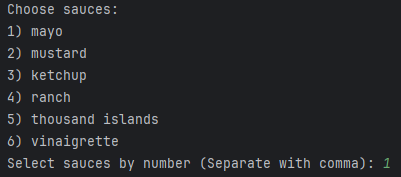
### Choose Sides:
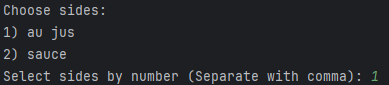
### Add Drink:
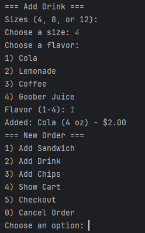
### Add Chips:
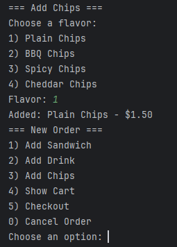
### Checkout Screen:
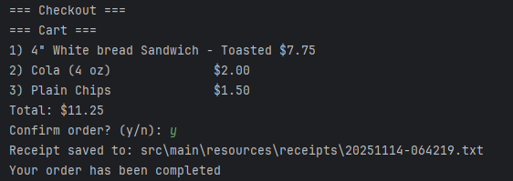
### Receipt:
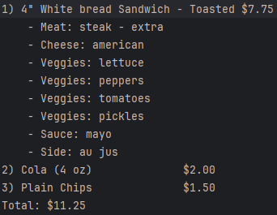

## <center>Interesting Code — Cart + Show Cart Display</center>

---

### In UserInterface Class

#### I store all orderable items in a single collection:

```java
private final List<OrderInterface> cart = new ArrayList<>();
```

#### OrderInterface only requires getName() and getPrice(), so the cart can hold any item type (Sandwich, Drink, Chips) as long as it implements the interface.

#### It loops through each OrderInterface item in the cart and prints a numbered list then displays the total.

```java
    private void showCart() {
    System.out.println("Cart:"); //header
    if (cart.isEmpty()) { //if List<OrderInterface> is empty, state cart is empty
        System.out.println("Empty cart.");
        return;  // Exit method early if nothing to show
    }
    int i = 1;  // numbers each item in the cart

    // Loop through every item in the cart list
    for (OrderInterface item : cart) { // For each item, of type OrderInterface, in cart
        String displayName = item.getName(); // calls getName on the item

        System.out.printf("%d) %-24s $%.2f%n", i++, displayName, item.getPrice());
        // Print the numbered list of items with their names and prices assigned
    }
    // After showing all items, print the total cost of the cart
    System.out.printf("Total: $%.2f%n", getCartTotal()); //calls getCartTotal to actually get the total
}
```

### Why it’s interesting:

#### The cart is flexible and reusable as new item types can be added easily by implementing OrderInterface.

#### Early on I was originally going to rename this to checkout and build from there but realized it could be used as a helper method for checkout and a feature for the user as well.